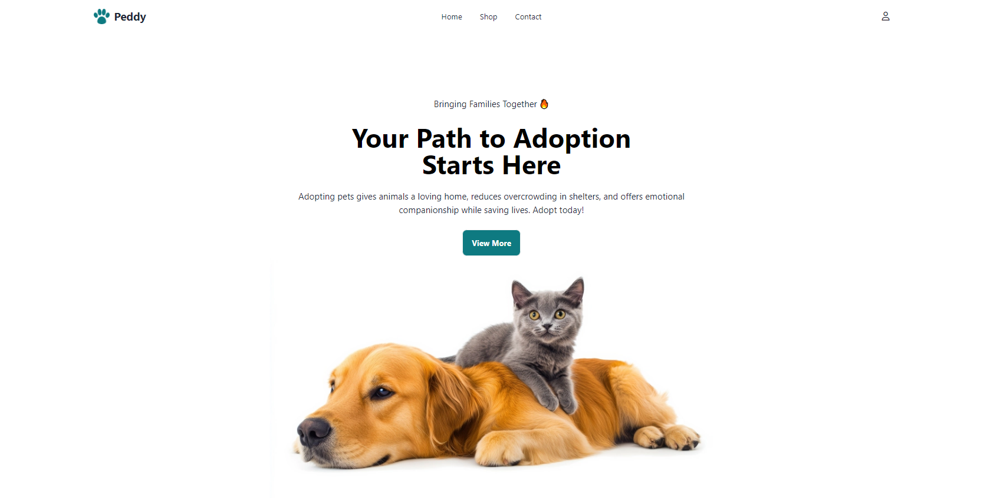

# Peddy Petshop
It's a petshop where user can adopt and can see the details of the pets also there's a category for every type of animal we have
## Fetch All Pets

### Endpoint: https://openapi.programming-hero.com/api/peddy/pets
### Description: Retrieves a list of all available pets for adoption. The data includes details like pet name, type, age, and adoption status.

# # 5 key features of the project:
### Liked pets gallery
### Responsive Website with tailwind
### Pet adoption system
### Category for pets
### Loading spinner for better experience

# Live Link :https://peddy-petshop.netlify.app/
# MainPage 
### 
# BestDeals(this is where you can like,adopt and see details all of this coming from the api  
### 
# Details(details showing infos are coming from api)
### 
